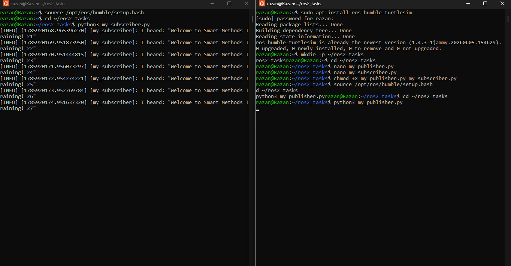
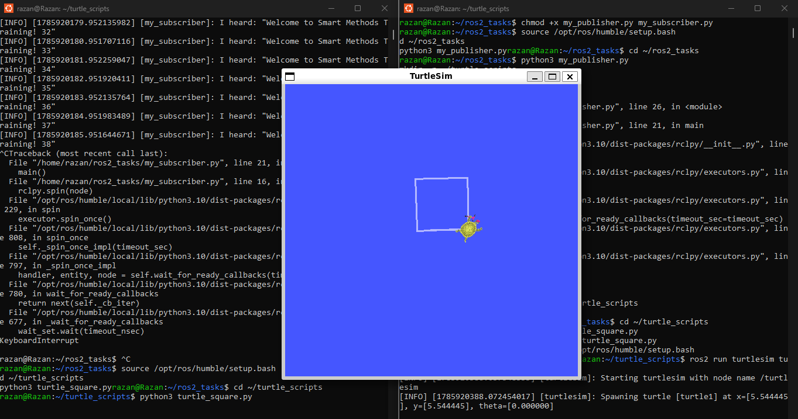

# Task - ROS2 Basics: Custom Pub/Sub & Turtlesim Square Motion

## Overview

This project involves the implementation of fundamental Robot Operating System (ROS2 Humble) nodes using Python. The task is divided into two main components: establishing a publisher-subscriber communication model to transmit a customized string message, and developing autonomous kinematic control for a robotic simulation (Turtlesim) to execute a predefined square trajectory.

## Implementation Algorithm (Step-by-Step)

The ROS2 tasks were executed using a systematic approach with specific node configurations to ensure correct communication and movement:

### Part 1: Custom Publisher and Subscriber

1. **Workspace Foundation (`ros2_tasks`):**
   * Created a dedicated directory using `mkdir -p ~/ros2_tasks` and navigated into it.
   * *Reason:* This establishes a structured and isolated workspace for the custom nodes, ensuring all scripts are properly referenced.

2. **Custom Data Transmission (`my_publisher.py`):**
   * Programmed a publisher node using `nano my_publisher.py` to broadcast a custom formatted string (`"Welcome to Smart Methods Training! {count}"`) over a custom topic (`my_topic`).
   * *Reason:* To demonstrate the ability to replace default standard messages (like "Hello World") with dynamic, customized payloads.

3. **Data Reception and Logging (`my_subscriber.py`):**
   * Implemented a subscriber node (`nano my_subscriber.py`) with a callback function that actively listens to `my_topic` and logs the incoming data directly to the terminal screen.
   * *Reason:* To verify real-time, asynchronous two-way communication between independent nodes within the ROS2 ecosystem.

4. **Node Execution:**
   * Granted execution permissions (`chmod +x`) and ran both scripts simultaneously in separate terminals using `python3`.
   * *Reason:* To initiate the communication bridge, allowing the publisher to send data while the subscriber actively listens in parallel.

### Part 2: Turtlesim Autonomous Square Trajectory

5. **Simulation Setup (`turtle_scripts`):**
   * Verified the `ros-humble-turtlesim` installation and created a dedicated directory (`~/turtle_scripts`).
   * *Reason:* To ensure all simulation dependencies are present and provide a clean workspace for the controller script.

6. **Kinematic Controller (`turtle_square.py`):**
   * Developed a controller node (`nano turtle_square.py`) that publishes `geometry_msgs.msg Twist` velocity commands to the `/turtle1/cmd_vel` topic.
   * *Reason:* To apply programmatic logic using a step-counter; alternating between linear velocity (`x = 2.0`) for straight movement and angular velocity (`z = 1.57`) for 90-degree turns, forcing the robot to draw a perfect square.

7. **Simulation and Controller Execution:**
   * Launched the simulation GUI (`ros2 run turtlesim turtlesim_node`) and executed the controller script (`python3 turtle_square.py`) in separate terminals.
   * *Reason:* To establish the connection between the custom logic node and the active simulation environment, driving the robot autonomously.

## Execution Views

### 1. Terminal Output (Pub/Sub Communication)

### 2. Turtlesim Simulation (Square Trajectory)

## Project Links & Files

### Python Scripts

The individual Python scripts have been exported and are available in the `Codes` directory, ready for execution:

* [my_publisher.py](Codes/my_publisher.py)
* [my_subscriber.py](Codes/my_subscriber.py)
* [turtle_square.py](Codes/turtle_square.py)
