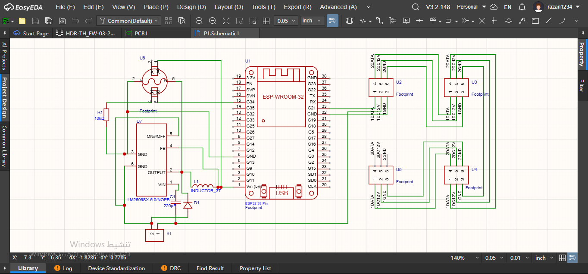
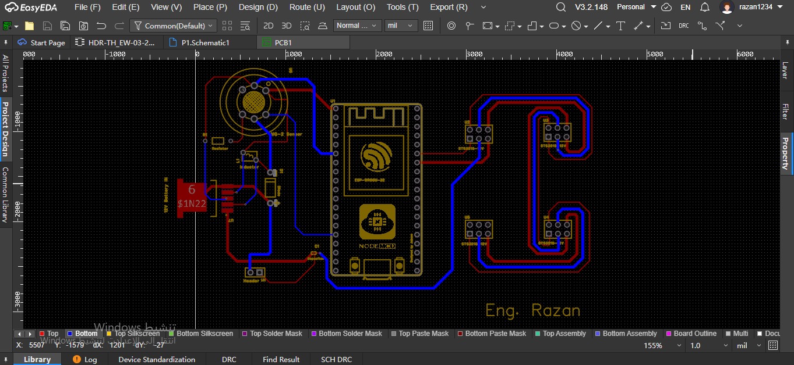
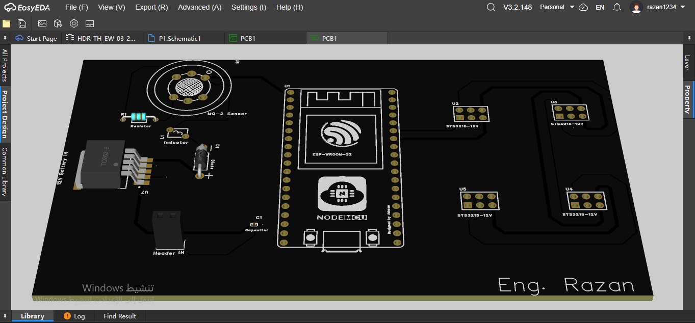

# Quadruped Robot Dog - Main Control Board (PCB)

This repository contains the Printed Circuit Board (PCB) design for the main control unit of my custom **[Quadruped Robot Dog](https://github.com/Razan-6677/Smart-Methods-Task/tree/main/Mechanical-Engineering/Dog-Robot-3D)**. The board is designed to be compact, capable of handling high current for the servo motors, and equipped with all necessary ports to operate the robot efficiently.

### Task Description:
Design a custom PCB for a quadruped robot that includes:
*   A main microcontroller (**ESP32**).
*   Four ports for connecting servo motors.
*   A power/battery input port.
*   A port for a sensor of choice.
*   Logical and organized component placement with clear silkscreen labels for all ports.
*   A **Double Layer PCB** routing design.

**This project was fully designed using [EasyEDA](https://easyeda.com/).**

---

## Design Phases & Details:

### 1. Schematic Design
In this phase, I defined the required electronic components and their logical connections to ensure a safe and functional circuit before moving to the physical layout.

**Key Components & Connections:**
*   **Microcontroller (ESP-WROOM-32 NodeMCU):** The brain of the robot. It is connected to all ports to send control signals to the motors and receive data from the sensor.
*   **Power Circuit:** Since the robot operates on a 12V battery and the microcontroller requires 5V, I designed a step-down (Buck Converter) circuit using the `LM2596S-5.0` chip. To ensure power stability and prevent voltage fluctuations, I included an Inductor (`L1`), a Capacitor (`C1`), and a Diode (`D1`).
*   **Servo Motor Ports (STS3215-12V):** Added 4 ports (U2, U3, U4, U5) to control the robot's legs. The power lines (12V and GND) are routed directly from the main power source, while the data lines are connected to designated GPIO pins on the MCU.
*   **Sensor Port:** Added a port for the `MQ-2` gas sensor to increase the robot's interaction with its environment, connecting it to power and an analog input pin on the MCU.

---

### 2. 2D PCB Layout & Routing
Here, the schematic was converted into a manufacturable board layout. I applied professional engineering standards during this phase:

*   **Double Layer PCB:** To avoid crossing wires and short circuits, I utilized both the Top Layer (Red) for direct routing and the Bottom Layer (Blue) for crossing paths.
*   **Trace Width Optimization:** Because the robot's motors draw high current to support the chassis weight during movement, I significantly increased the width of the power traces (12V and GND) to handle the load without overheating. The data traces were kept at standard width since they only transmit low-current signals.
*   **Silkscreen Labels:** To facilitate the soldering and assembly process later, I added clear yellow silkscreen text next to the ports (e.g., `12V Battery IN`, `MQ-2 Sensor`, and the motor model `STS3215-12V`).

---

### 3. 3D PCB View & Final Result
This is the final realistic 3D render of the board before manufacturing. 

*   The layout demonstrates a logical flow of components: the power circuit on the left to regulate electricity upon entry, the microcontroller in the center to distribute commands, and the motor ports on the right for easy wiring to the robot's legs.
*   Added a personal engineering touch with my signature **(Eng. Razan)** in the bottom right corner to document the ownership of this design.

