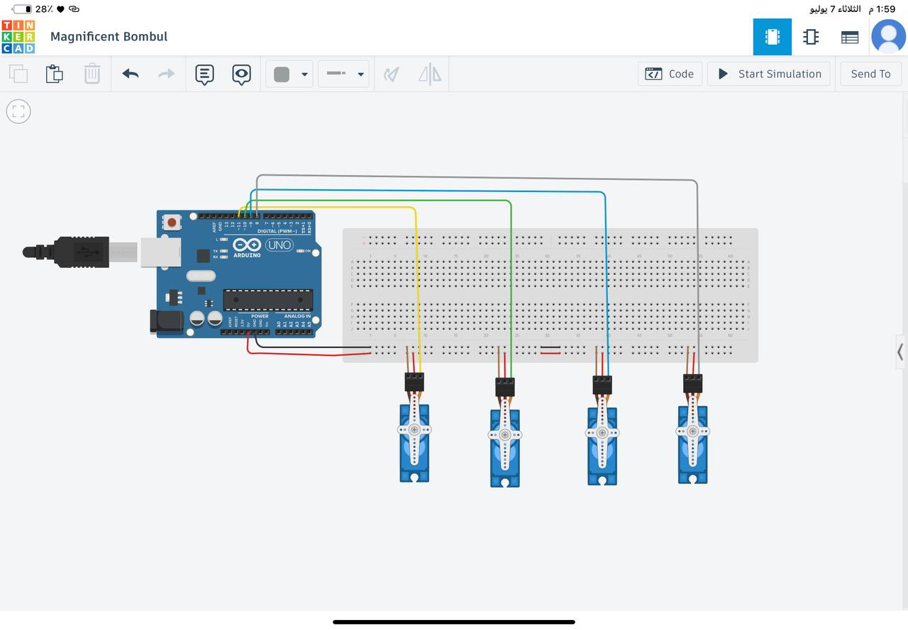

# Task 1 - Servo Motor Control (4x Servo Sweep + Hold)

## Task Description
Program 4 servo motors to perform the following actions:
1. Run using the Sweep example for 2 seconds.
2. After that, make all the motors hold at 90 degrees.

## Circuit
The circuit was built and simulated using Tinkercad, connecting 4 servo motors to an Arduino UNO via digital PWM pins (8, 9, 10, 11), with power and ground shared through the breadboard rails.

[Try the circuit on Tinkercad](https://www.tinkercad.com/things/ibdyJdXobLg-circuit?sharecode=aZX9URD-YRiuRIGHZWKpwT8znb8Sz2a58n1fWP0uOd0)

## Code
See [servo_control](code/servo_control)

## Demo Video
[Watch the video here](https://drive.google.com/file/d/1cK1zHUgOKbqKjlbezvj_VcvjdVC5XKW-/view?usp=drivesdk)
