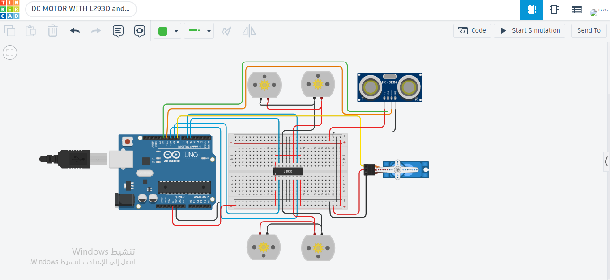

# Task 2: Obstacle Avoiding Robot Base & Motor Control 🚗🤖

This repository contains **Task 2** of the Smart Methods simulation assignments. The project demonstrates motor control and obstacle detection using an **Arduino Uno**, an **L293D Motor Driver**, an **Ultrasonic Sensor**, and a **Servo Motor** designed and simulated on **Tinkercad**.

## 🎯 Task Objectives & Requirements
The project fulfills the following hardware simulation requirements:

1. **4 DC Motors Control using L293D Motor Driver**:
   - Programmed to execute a specific movement sequence:
     - Move **Forward** for 30 seconds.
     - Move **Backward** for 1 minute.
     - Alternate moving **Right and Left** for 1 minute.

2. **Obstacle Detection & Avoidance**:
   - Integrated 1 **Servo Motor** with the **L293D IC** and an **HC-SR04 Ultrasonic Sensor**.
   - If an obstacle is detected within **10 cm**, the four motors immediately stop and change their direction to avoid collision.

## 📸 Circuit Design & Diagram

*Figure: Circuit schematic on Tinkercad illustrating the Arduino Uno wired to a breadboard containing the L293D motor driver chip, 4 DC motors (representing the robot wheels), HC-SR04 ultrasonic sensor for distance measurement, and a micro servo motor.*

## 🔗 Links & Demo
- **Tinkercad Simulation:** [View & Run Simulation](Https://www.tinkercad.com/things/aD3prAP6Mub-dc-motor-with-l293d-and-servo)
- **Video Demonstration:** [Watch Video on Google Drive](https://drive.google.com/file/d/1zpPnBimd5p-BS4CxBiaPUMnfFZiyoHuF/view?usp=drivesdk)

## 💻 Source Code
- [code/Dc_servo.ino](code/Dc_servo.ino) — Arduino source code for the simulation.

---
#Task2 #Arduino #Tinkercad #Robotics #L293D #SmartMethods #DCMotor #Ultrasonic #Servo
