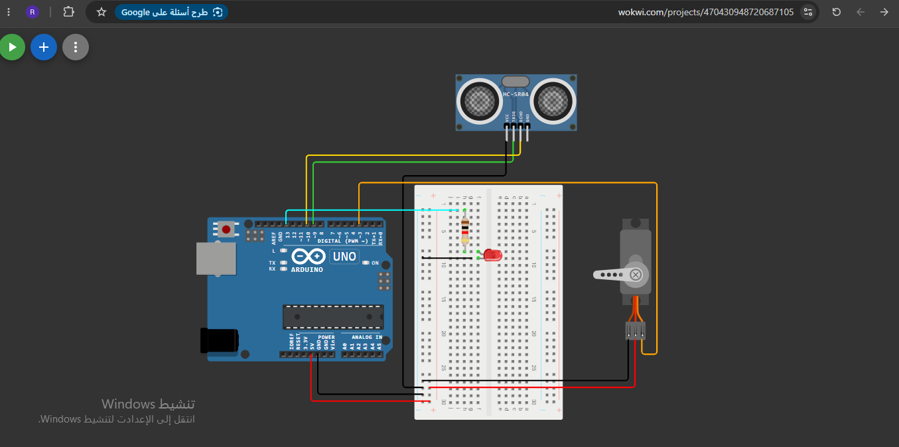

# Task: Ultrasonic Sensor & Servo Motor Control

## Overview
This project demonstrates how to control a **Servo Motor** based on distance measurements from an **HC-SR04 Ultrasonic Sensor**, simulated using **Wokwi**. An **LED** is also integrated as an optional visual indicator that lights up when the servo is activated.

## Task Requirements & Logic
1. **Distance Measurement:** The HC-SR04 sensor continuously calculates the distance of objects in front of it using ultrasonic waves.
2. **Servo Activation:** If an object is detected at a specific distance (e.g., <= 10 cm), the Arduino commands the servo motor to rotate to a targeted angle.
3. **LED Indicator (Bonus):** When the servo moves to the target angle, the LED turns ON to visually indicate the detection.
4. **Reset State:** Once the object moves away and the distance exceeds the threshold, the servo returns to its original base position, and the LED turns OFF.

## Simulation Circuit

*The circuit includes an Arduino Uno, an HC-SR04 distance sensor, a micro servo motor, and an LED with a current-limiting resistor connected via a breadboard.*

## Source Code & Simulation Link
- **Wokwi Simulation:** [Click here to view simulation](https://wokwi.com/projects/470430948720687105)
- **Source Code:** [code/servo.ino](code/servo.ino)
