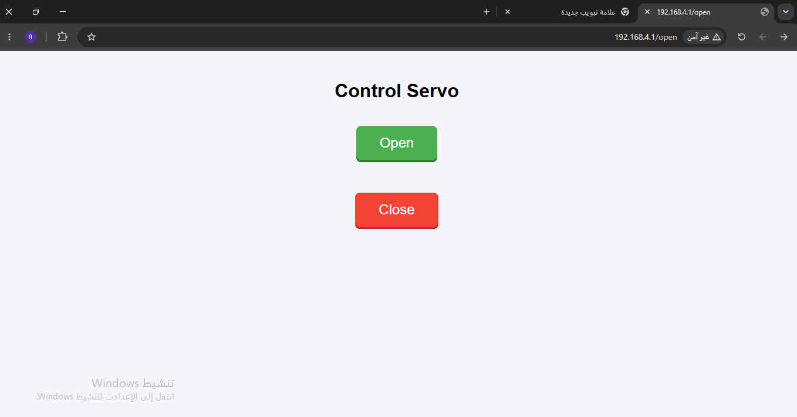

# Task 4 - Electronics: ESP32 Web Server Servo Control

## Overview

This task demonstrates how to control a Servo motor and LED indicators via a web interface hosted on an ESP32 configured as a WiFi Access Point (AP).

## Part 1: Implementation Approach

**Hybrid Approach:** The circuit design and connections were initially modeled using the Wokwi simulation platform. However, because simulating ESP32 WiFi gateway features requires a premium subscription on the platform, the fully functional project was directly built and tested on real physical hardware.

## Part 2: Hardware Setup

**Components Used:** ESP32, Servo Motor, Red LED, Green LED, Resistors, and a Breadboard.

**System States:**
**Open State:** The Servo rotates to 90 degrees, the Green LED turns ON, and the Red LED turns OFF.
**Closed State:** The Servo returns to 0 degrees, the Red LED turns ON, and the Green LED turns OFF.

## Part 3: Web Server Configuration

**Access Point:** The ESP32 is programmed to broadcast a local WiFi network named "Razan".

**Web Interface:** Connecting to this network and navigating to the assigned IP address loads an HTML web page with "Open" and "Close" buttons. Pressing these buttons sends HTTP GET requests (`/open` or `/close`) to trigger the hardware states in real-time.

## Part 4: Project Media & Code

**Wokwi Simulation Circuit:**

**Physical Hardware Setup:**

**Web Interface Preview:**

**Project Links:**
**Wokwi Workspace:** [View Simulation Here](https://wokwi.com/projects/470800101176411137)
**Hardware Demo Video:** [Watch the real-time execution on Google Drive](https://drive.google.com/file/d/1Evf2Yl7YHZ7fM2jvi9NBHdcA3gj6q094/view?usp=drivesdk)
**Source Code:** [Code/server.ino](Code/server.ino)
