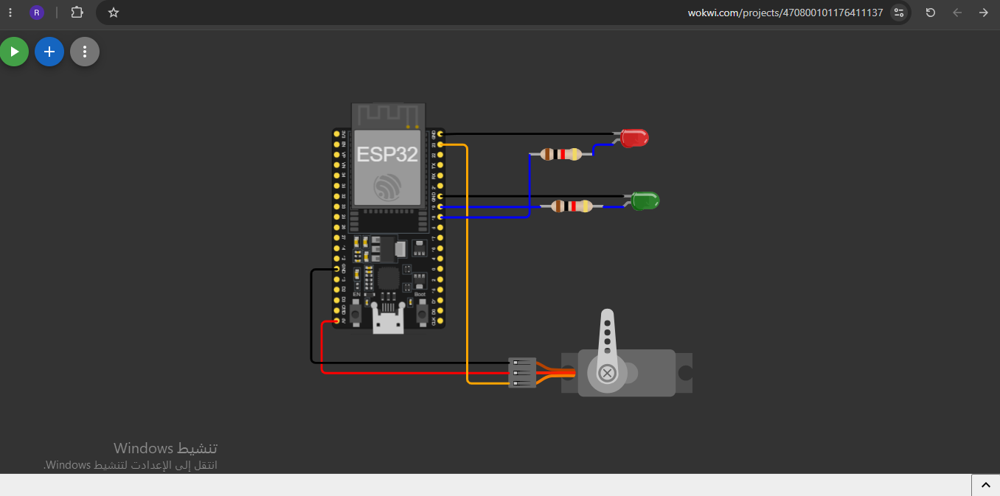
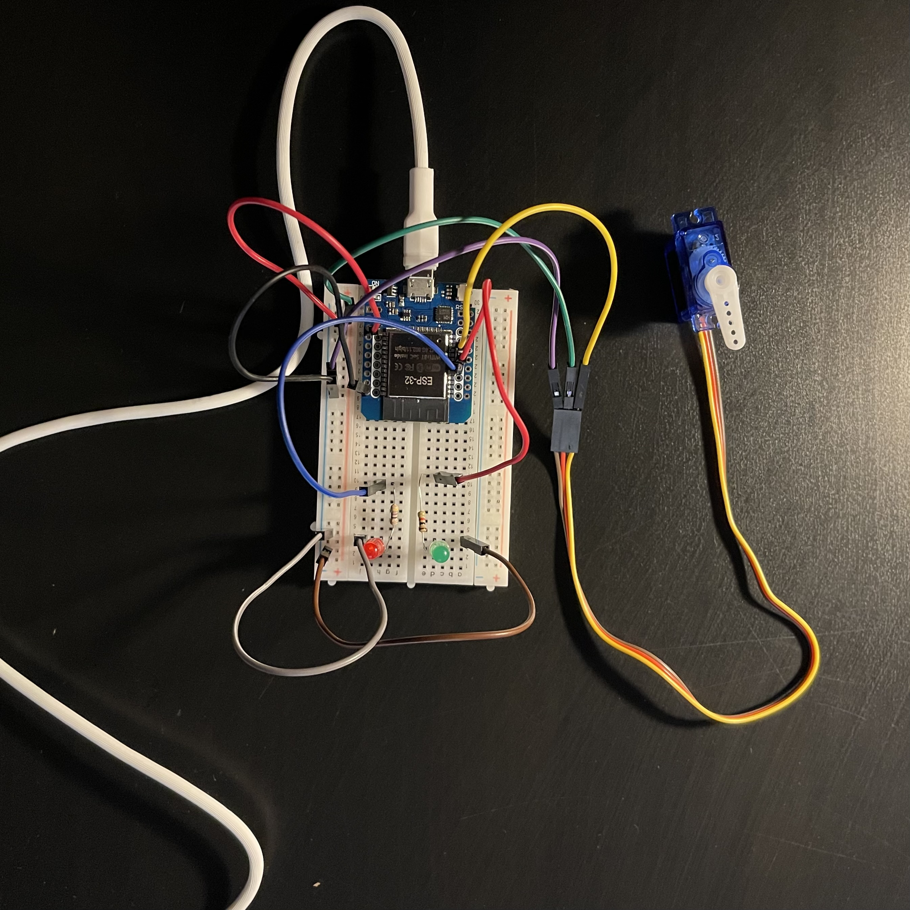

# Task 4 - Electronics: ESP32 Web Server Servo Control

## Overview

This project demonstrates how to control a **Servo Motor** and LED indicators via a web interface hosted on an **ESP32** configured as a WiFi Access Point (AP). The circuit was initially designed in **Wokwi** and subsequently built and tested on physical hardware.

## Task Requirements & Logic

1. **Access Point Setup:** The ESP32 broadcasts a local WiFi network named "Razan".
2. **Web Interface:** Upon connecting to the network and accessing the assigned IP address, an HTML web page with "Open" and "Close" buttons is served.
3. **Open Command:** Clicking "Open" triggers the ESP32 to rotate the Servo motor to 90 degrees, turn the Green LED ON, and turn the Red LED OFF.
4. **Close Command:** Clicking "Close" commands the ESP32 to return the Servo motor to 0 degrees, turn the Red LED ON, and turn the Green LED OFF.

## Wiring Configuration

- **Servo Motor:** The signal wire is connected to **GPIO 23**.
- **Red LED:** The positive leg (Anode) is connected to **GPIO 18**.
- **Green LED:** The positive leg (Anode) is connected to **GPIO 19**.
- **Power & Ground:** All components share a common Ground (GND), and the LEDs are connected through current-limiting resistors.

## Simulation Circuit

*The circuit includes an ESP32, a micro servo motor, a red LED, and a green LED with current-limiting resistors connected via a breadboard, modeled in Wokwi.*

> [!NOTE]
> While the circuit layout is designed in Wokwi, simulating the ESP32 WiFi Access Point and Web Server requires a premium subscription on the platform to access WiFi gateway features. Consequently, the actual web interface execution was performed directly on the physical hardware.

## Hardware Implementation

*The fully functional physical hardware setup executing the web server commands in real-time.*

## Source Code & Links

- **Wokwi Simulation:** [Click here to view simulation](https://wokwi.com/projects/470800101176411137)
- **Hardware Demo Video:** [Watch the real-time execution here](https://drive.google.com/file/d/1Evf2Yl7YHZ7fM2jvi9NBHdcA3gj6q094/view?usp=drivesdk)
- **Source Code:** [Code/server.ino](Code/server.ino)
