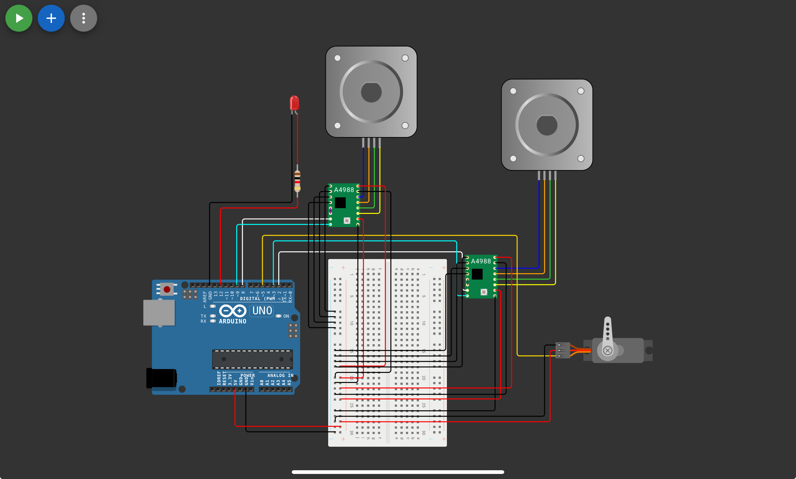

# Task - Smart Gate Simulation System

## Overview
This project simulates an automated smart entry gate for vehicles. The system integrates three different motor functions, executing a sequential logic to simulate a real-world scenario: scanning a vehicle's license plate, dispensing an entry ticket, and opening the gate barrier. The project is designed and simulated using Wokwi.

> **Hardware Note:** The original task required a DC Motor for the ticket dispenser. Since Wokwi does not feature a standard DC motor component for this specific configuration, a second Stepper Motor was used instead. It was programmed to continuously spin for a set duration to accurately mimic the behavior and speed of a DC motor.

## System Workflow & Motor Functions

The simulation follows a strict three-step sequential scenario:

1. **Area Scan (Surveillance Camera) - Stepper Motor 1:**
   - **Function:** Simulates a security camera scanning the vehicle's license plate.
   - **Logic:** The motor moves precisely 45 degrees to the right, then 45 degrees to the left, and finally returns to the center position.

2. **Ticket Issuance - Stepper Motor 2 (Simulating DC Motor):**
   - **Function:** Simulates the ticket machine dispensing a ticket.
   - **Logic:** Once the camera finishes scanning, this motor runs continuously for exactly 2 seconds to "dispense the ticket," then stops completely, perfectly mimicking DC motor behavior.

3. **Gate Opening (Barrier) - Servo Motor:**
   - **Function:** Represents the physical barrier of the entry gate.
   - **Logic:** Immediately after the ticket machine stops, the servo rotates from 0° to 90° to open the gate. It waits for 3 seconds to allow the car to pass, then returns to 0° to close the gate.

## Simulation Circuit

*Figure: The Wokwi simulation circuit featuring an Arduino Uno, two Stepper Motors with A4988 drivers (representing the camera and ticket dispenser), a Micro Servo Motor (representing the gate barrier), and an LED indicator.*

## Links & Files
- **Wokwi Simulation:** [Click here to view and run the simulation](https://wokwi.com/projects/470424347242983425)
- **Source Code:** [Code/gate.ino](Code/gate.ino)

---
#Arduino #Wokwi #SmartGate #Robotics #ServoMotor #StepperMotor #SmartMethods #Automation
