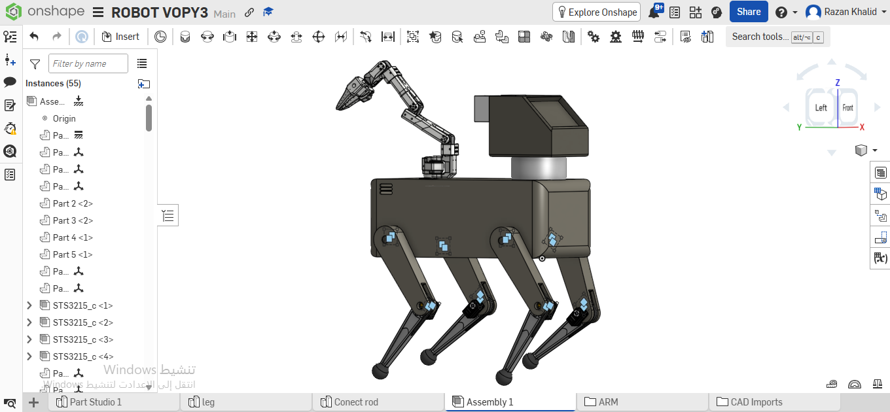
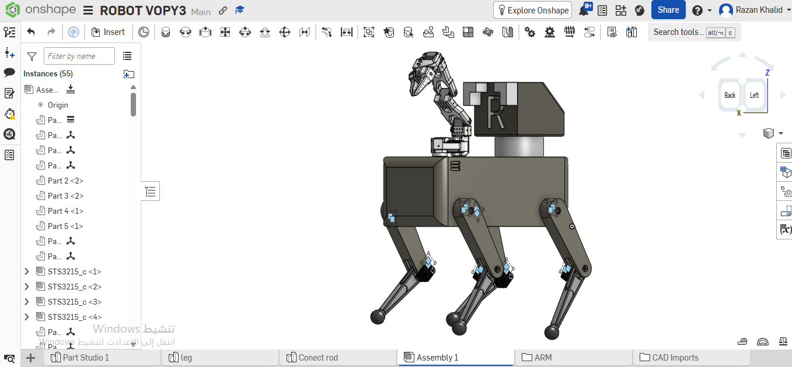

# Quadruped Robot Dog - 3D Parametric Design

## About the Project
This repository contains the 3D design of a quadruped robot for the Smart Methods summer training tasks. This robot was entirely designed and modified using Parametric CAD methodology to meet the engineering requirements for the robot's locomotion.

## Tools Used
* **Primary Design Software:** Onshape (Parametric 3D CAD).
* Direct modeling was avoided; instead, the models were built geometrically by creating 2D sketches based on precise measurements, which were then converted into 3D models.

## Design Details
* Designed and assembled the robotic dog chassis (Assembly), ensuring the proper kinematics and movement of all joints.
* Performed reverse engineering to modify the arm base, creating a low-profile mount to lower the center of gravity and ensure the robot's balance.
* Customized the base to perfectly fit the dimensions of servo motors such as the STS3215.
* Added industrial and practical details like cooling vents for the internal electronics.

## Future Vision: Hazardous Chemical Response

Imagine this robot living permanently inside a chemical factory or storage facility — always walking around, always watching.

- **The legs** let it patrol the entire site on its own, moving over pipes, uneven floors, and tight spaces a wheeled robot can't reach.
- **A gas sensor on its body** constantly "smells" the air. The moment it detects a leak, it knows immediately — faster than any human could notice.
- **The screen on its front** lights up green, yellow, or red so anyone nearby can instantly tell if the area is safe or dangerous, just by looking at it.
- **The arm** then takes action: it can close a nearby valve to stop the leak from getting worse, place an absorbent pad over the spill to contain it, and collect a small sample so the safety team knows exactly what chemical they're dealing with before they even arrive.
- **A wireless alert** is sent out at the same time, calling the human team so they can take over the situation safely — the robot buys precious time and reduces risk, but the final decisions stay with people.

In short: the robot is always on guard, catches danger the moment it starts, takes simple first-response actions to slow it down, and calls humans in before things get worse — all without ever putting a person in harm's way first.

### Why This Matters
Workplace chemical exposure is a real and ongoing global problem, not a rare edge case:
* The World Health Organization estimates that hazardous chemical exposure in occupational settings causes **over 370,000 premature deaths every year worldwide**.
* In the United States alone, OSHA reports **more than 50,000 deaths annually** linked to workplace chemical exposure, with a serious industrial chemical accident occurring roughly **every two and a half days**.

A robot that can detect a leak the instant it happens and take basic first-response action before any human enters the danger zone directly targets the exact gap behind these numbers: the delay and direct exposure that happens *before* trained responders arrive.

## Credits & Attribution
* The robotic arm/leg mechanism incorporated in this design is based on the open-source **[SO-ARM100 project](https://github.com/TheRobotStudio/SO-ARM100)** by TheRobotStudio, utilized and modified under the Apache 2.0 License.

## Design Views

## Included Files
In accordance with the task requirements, all design parts have been exported in `STL` format, ready for 3D printing.

🔗 **[Download STL Files](Files/Assembly%201%20(2).zip)**

## CAD Workspace
Interactive design workspace:

🔗 **[Onshape Workspace](https://cad.onshape.com/documents/47190db977abb20ca8b6d95c/w/49268a5758bd2a20957b8ea2/e/e141a62b0fd248f83cad45e9?renderMode=0&uiState=6a71126458da964de8b8cda6)**

> [!NOTE]
> If you get a "403 Forbidden" error, just copy the link and paste it into a new tab. Onshape sometimes blocks direct clicks from GitHub.

## References
* World Health Organization (WHO) — occupational hazardous chemical exposure mortality estimates.
* U.S. Occupational Safety and Health Administration (OSHA) — *Transitioning to Safer Chemicals: A Toolkit for Employers and Workers*, osha.gov/safer-chemicals.
* BlueGreen Alliance — Chemical Safety, bluegreenalliance.org/work-issue/chemical-safety.
