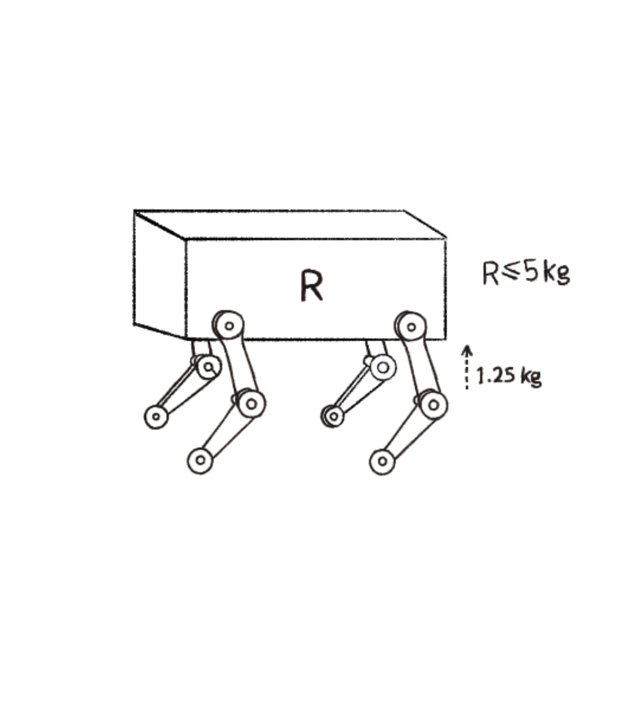
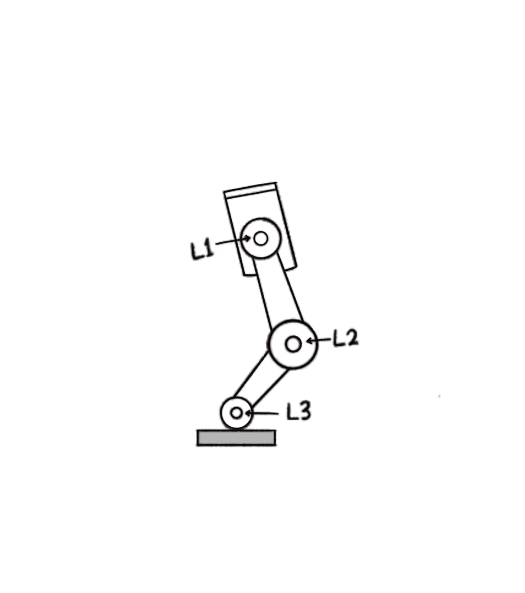

# Task 1 - Quadruped Robot Mechanical Design

## 1) Body Shape and Frame
The body is a simple box-shaped frame representing the robot's torso. The material used is PLA+ plastic, because it is lightweight, reduces the load on the servos, and is easy to manufacture.

## 2) Leg Design
Each of the robot's four legs is made up of 3 parts, with the following lengths:

| Link | Description | Length |
|------|-------------|--------|
| L1 | Body/hip connector | 7 cm |
| L2 | Thigh (femur) | 10 cm |
| L3 | Shin (tibia) | 5 cm |

The lengths are staggered, not equal, in order to keep a low center of gravity and ensure better stability.

## 3) Number of Joints and Degrees of Freedom
Each leg has 3 joints, and each joint is driven by an independent motor so it has its own degree of freedom:
- L1: First joint, moves the torso together with the hip joint
- L2: Second joint, moves the thigh
- L3: Third joint, moves the shin

This means each leg = 3 degrees of freedom, and the full robot (4 legs) = 12 degrees of freedom in total.

> Note: I chose to focus the torque calculation on the thigh joint (L2) because it is the longest link. However, in practice, the hip joint (L1) actually bears a greater torque, since it supports the weight of L2, L3, and the full load above them. This is an intentional simplification at this early design stage.

## 4) Motor Selection
We use JX brand servo motors, with the following specifications:
- Torque: 12.5 kg·cm
- Rotation range: 300°

## 5) Preliminary Torque Calculation for One Joint
I chose to calculate torque at the thigh joint (L2), since its length (10 cm) is the longest among the three links, making it the one subject to the greatest torque compared to L1 and L3.

Assuming the maximum load each leg can carry is 1.25 kg, and the arm length (r) at this joint = 10 cm:

Using the torque equation τ = F × r, where F = 1.25 kg and r = 10 cm:

Torque = 1.25 kg × 10 cm = 12.5 kg·cm

This value matches exactly the torque of the selected servo (JX). However, I noticed this means the motor would be operating at its absolute maximum capacity with zero safety margin — which isn't practical, because during a Trot gait, not all legs touch the ground at the same time. This means only two legs may be supporting the robot's full weight at certain moments, so the actual load could exceed this initial assumption.

For this reason, it would be better to select a motor with a higher torque rating than calculated — around 20 kg·cm — to provide an adequate safety margin.

Given that each leg can support 1.25 kg, the maximum ideal-case weight is:

4 × 1.25 kg = 5 kg

So the robot's total weight should stay under 5 kg, ideally around 3.5–4 kg to maintain a safety margin.

## 6) Stability and Center of Gravity
The robot's center of gravity will be located roughly at the middle of its body. The four legs will be spread apart from each other to allow greater stability, and the support base will shrink during walking — so it's essential to ensure the center of gravity always stays within that support base.

## 7) Proposed Gait
The robot's walking method will use a Trot gait, in which two diagonal pairs of legs move alternately. For example, the front-right leg and the back-left leg move forward together, while the front-left leg and the back-right leg stay planted on the ground to support the weight — then the two pairs switch roles.

This gait was chosen because it is the most suitable compared to other walking patterns: it is stable, keeps the center of gravity balanced, and is inspired by how real animals such as dogs and cats walk.

## 8) Expected Mechanical Issues
- Torque issue: If the torque isn't sufficient, or a sudden acceleration occurs, the servo may fail to move the joint or could stall entirely.
- Material issue: If the robot's actual weight exceeds the planned value, the legs may not be able to support it.
- Alignment issue: If the three joints aren't assembled precisely, the shaft could break or excessive friction could occur.
- Ground friction issue: On smooth/slippery floors, friction between the robot and the ground decreases, and the robot could lose balance and slip instead of walking forward.
