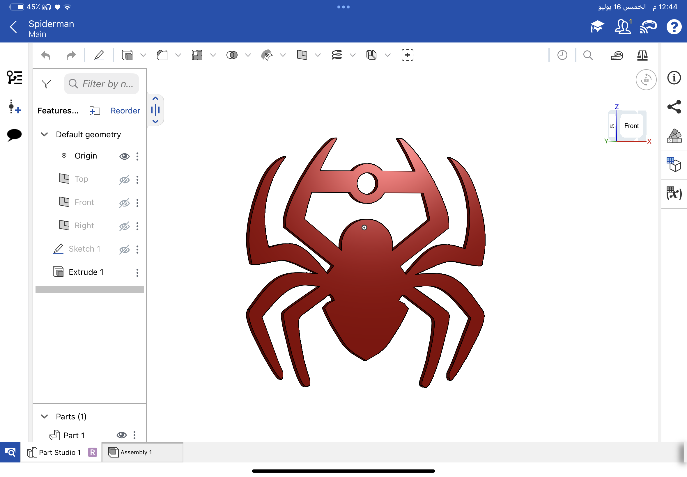

# Mechanical Task 2 - 3D Keychain Design

## Task Description
The objective of this task is to practice 2D sketching and 3D extrusion by designing a custom keychain. The requirements include choosing an image from the internet, estimating its dimensions, sketching it in CAD software, adding a 4mm circular cut for the keychain ring, extruding the sketch by 2mm, and exporting the final model as an STL file.

## Implementation Details
For this task, I chose to design the **Spiderman Logo**.
- **Software Used:** [Onshape](https://www.onshape.com/)
- **Process:** 1. Sketched the Spiderman logo based on a reference image.
  2. Added a 4mm hole at the top section to serve as a keychain holder.
  3. Extruded the 2D sketch by 2mm to create the 3D solid body.
- **Design Link:** [View my 3D design on Onshape](https://cad.onshape.com/documents/f337e3f3314e46683abdd6fe/w/4f2dce4f16c4b5a1d9ac887f/e/55ed7159b2d8c51a28b5ec69)
- **Demo Video:** [Watch the design preview here](https://drive.google.com/file/d/19rRfCldXPScWrgJTA2_THFCTY5PJsTVa/view?usp=drivesdk)

## Files
- `spiderman_keychain.stl`: The exported 3D model ready for 3D printing.

## Output
Here is a preview of the final 3D extruded model in Onshape:

