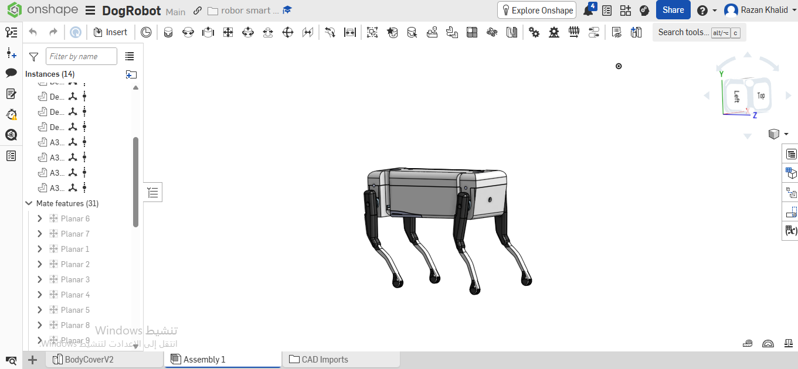
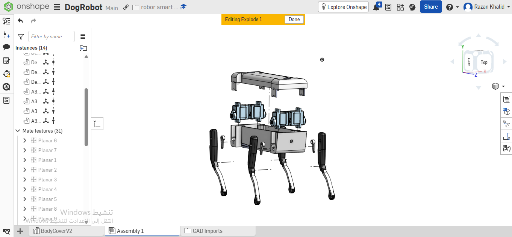

# Task 3 - Quadruped Robot Dog Mechanical Assembly 

## Overview
This project involves the mechanical assembly of a quadruped robot dog using **Onshape**. The design adheres to the physical constraints of an agile robotic system, focusing on modularity and proper kinematic linkages for locomotion.

## Assembly Algorithm (Step-by-Step)

The robot was assembled using a systematic approach with specific CAD mates to ensure correct degrees of freedom:

1. **Base Foundation (BodyV2):** 
   - Inserted the `BodyV2` component first and applied a **Fix** constraint. 
   - *Reason:* This establishes the main chassis as the rigid, immovable root of the assembly, ensuring all subsequent parts have a stable point of reference.
2. **Actuator Integration (SG90 Servos):**
   - Attached 4x `SG90` servo motors to the main body using **Planar** mates to align them flush against the chassis mounting brackets.
3. **Casing Assembly (BodyCoverV2):**
   - Installed the `BodyCoverV2` over the core chassis utilizing **Planar** mates to secure the internal electronics and structural integrity.
4. **Linkage Mechanism (microservoArm):**
   - Attached the `microservoArm` components to the output shafts of the 4 SG90 servos.
   - Applied **Revolute** mates to allow exactly one rotational degree of freedom, simulating the sweeping motion of the servo.
5. **Leg Assembly (rightLeg & leftLeg):**
   - Mounted the `rightLeg` and `leftLeg` appendages to the servo arms.
   - Utilized a strategic combination of **Cylindrical**, **Parallel**, and **Planar** mates to lock the necessary axes while maintaining the correct parallel kinematics for the walking gait.

## Assembly Views

### 1. Fully Assembled View

### 2. Exploded View (Internal Mechanics)

## Project Links & Files
- **Onshape 3D Workspace:** [Click here to explore the interactive 3D model](https://cad.onshape.com/documents/134e4062060a8944946765ca/w/2ba4041f3ea56f9c686fb0df/e/f77bc74fd98199bed8a6102e)

### 3D Printable Files (STL)
The individual part files have been exported and are available in the `files` directory, ready for 3D printing:
- [BodyV2](files/BodyV2.stl)
- [BodyCoverV2](files/BodyCoverV2.stl)
- [Right Leg](files/rightLeg%20-%20Default.stl)
- [Left Leg](files/leftLeg%20-%20Default.stl)
- [Micro Servo Arm](files/microservoArm%20-%20A3.stl)
