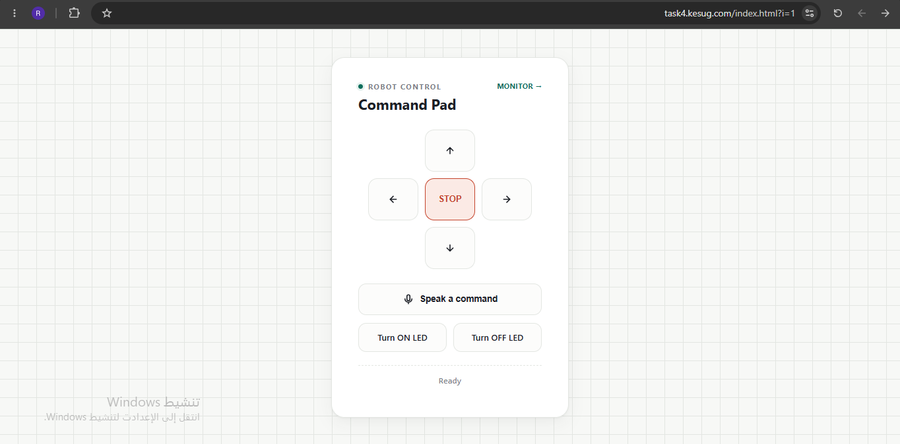
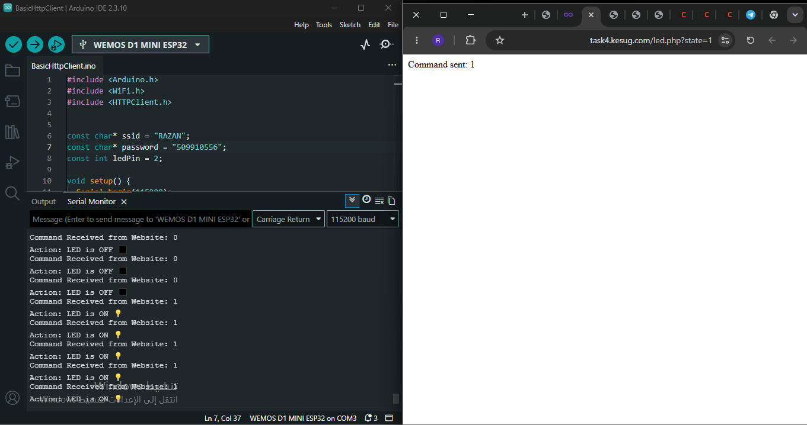
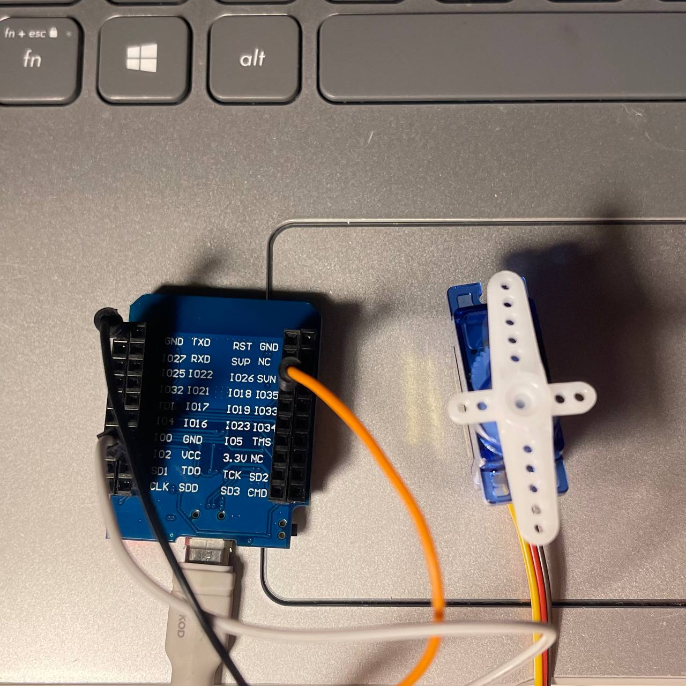
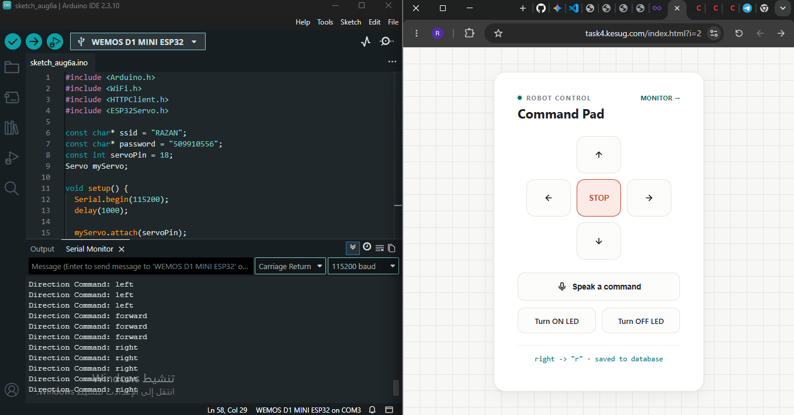

# Task - Web-Controlled LED and Servo Motor

## Overview
This project demonstrates IoT (Internet of Things) capabilities by establishing a real-time, two-way communication system between a custom web interface and a micro-controller (Wemos D1 Mini ESP32). The task is divided into two main components:
1. **Control LED via Web**
2. **Control Servo via Web**

To overcome free-hosting security barriers (which block direct hardware-to-PHP HTTP requests), a reliable intermediary text-file approach was implemented.

---

## Part 1: Control LED via Web

### Implementation Steps & Code Modifications

1. **Web Interface (`index.html`):**
   - Added two dedicated buttons ("Turn ON LED" and "Turn OFF LED") to the control pad.
   - These buttons trigger a GET request to a new PHP script with the respective state parameter (`?state=1` or `?state=0`).

2. **Backend Logic (`led.php` & `t.txt`):**
   - Created `led.php` to receive the state parameter.
   - Instead of the ESP32 reading the PHP file directly (which gets blocked by the server's security), `led.php` writes the received state ("1" or "0") into a plain text file named `t.txt`.

3. **Hardware Logic (`led.ino`):**
   - Programmed the ESP32 to connect to a local WiFi network.
   - The ESP32 sends an HTTP GET request to `t.txt` every 2-3 seconds.
   - It reads the payload, trims any hidden spaces, and uses standard `if` conditions to execute `digitalWrite(LED_BUILTIN, HIGH / LOW)`.

### Media Gallery
* **Hardware & Web Demonstration:**
  
  

* **Video Demonstration:**
  [Click here to watch the LED Control Video on Google Drive](https://drive.google.com/file/d/1x3kGflS0WfjqltRMzrd3Mr5O6OMZ0MSj/view?usp=drivesdk)

---

## Part 2: Control Servo via Web

### Hardware Wiring (SG90 Servo to Wemos D1 Mini ESP32)
The servo motor requires sufficient power and a PWM-capable data pin. The wiring is established as follows:
* **Brown/Black Wire (Ground):** Connected to the **GND** pin.
* **Red/Orange Wire (Power):** Connected to the **VCC** (5V) pin to ensure sufficient current.
* **Yellow/White Wire (Signal):** Connected to the **IO18** pin for data transmission.

### Implementation Steps & Code Modifications

1. **Web Interface Integration (`index.html`):**
   - Instead of adding separate buttons for the servo, the existing directional pad (Forward, Right, Left, Stop) was utilized to create a more realistic robotic steering mechanism.
   - Modified the JavaScript `fetch` function to send the command to **two** files simultaneously: the original database logger (`update_command.php`) and the new servo controller (`dir.php`), ensuring the original code remained intact.

2. **Backend Logic (`dir.php` & `dir.txt`):**
   - Created `dir.php` to receive the directional POST requests.
   - It writes the string command (e.g., "forward", "right") into a plain text file named `dir.txt` to bypass server firewalls safely.

3. **Hardware Logic (`servo.ino`):**
   - Included the `<ESP32Servo.h>` library for proper PWM generation.
   - Initialized the servo on pin 18 and set its default position to 90 degrees.
   - The ESP32 reads `dir.txt` periodically and maps the strings to servo angles:
     - `"forward"` or `"stop"` $\rightarrow$ `90°` (Center)
     - `"right"` $\rightarrow$ `0°` (Max Right)
     - `"left"` $\rightarrow$ `180°` (Max Left)

### Media Gallery
* **Wiring Setup:**
  
  

* **Video Demonstration:**
  [Click here to watch the Servo Control Video on Google Drive](https://drive.google.com/file/d/1RncZVJ0TkAo9F0bl0y32EZ0FjZwv0fsB/view?usp=drivesdk)

---

## Project Directories & Files

The project source codes are organized into specific directories. Click on any file name below to view its source code:

###  CntrolLed1 (LED Control Files)
- [index.html](Codes/CntrolLed1/index.html) - Web UI with LED buttons
- [led.php](Codes/CntrolLed1/led.php) - Backend state handler
- [t.txt](Codes/CntrolLed1/t.txt) - Text bridge for ESP32
- [led.ino](Codes/CntrolLed1/led.ino) - ESP32 Arduino code for LED
- [db.php](Codes/CntrolLed1/db.php) - Database connection
- [setup.sql](Codes/CntrolLed1/setup.sql) - Database setup query
- [monitor.html](Codes/CntrolLed1/monitor.html) - Interface for monitoring

###  cntrolServo (Servo Control Files)
- [index.html](Codes/cntrolServo/index.html) - Updated Web UI with dual-fetch JS
- [dir.php](Codes/cntrolServo/dir.php) - Backend directional handler
- [servo.ino](Codes/cntrolServo/servo.ino) - ESP32 Arduino code with Servo library integration
- [update_command.php](Codes/cntrolServo/update_command.php) - Base tracking file (command updater)
- [get_state.php](Codes/cntrolServo/get_state.php) - Base tracking file (state retriever)
