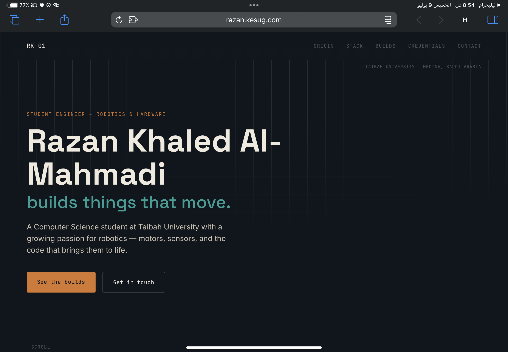
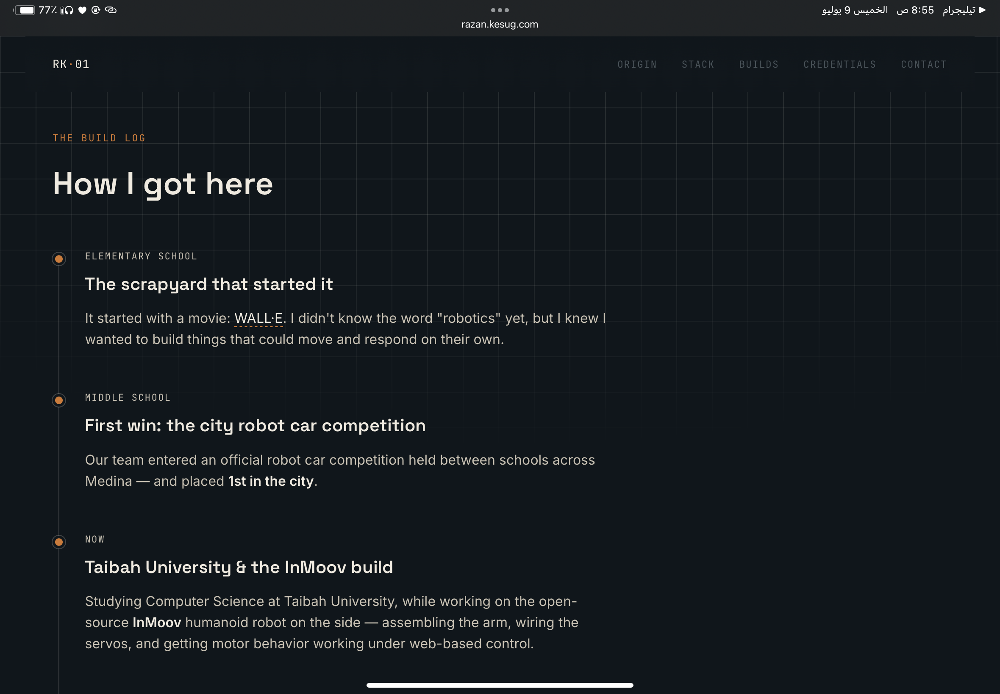
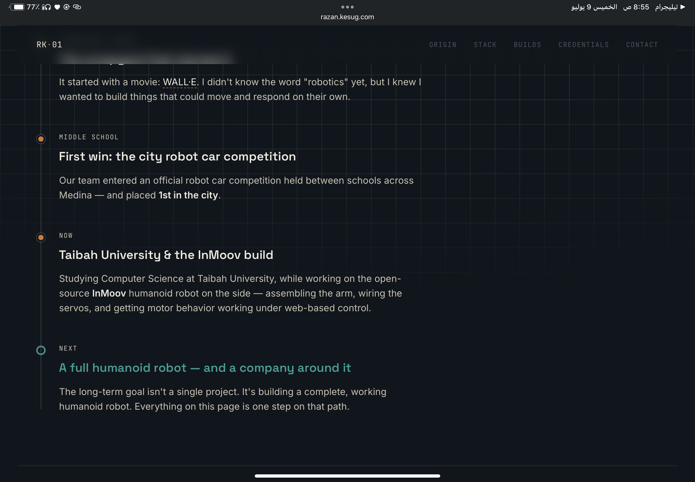
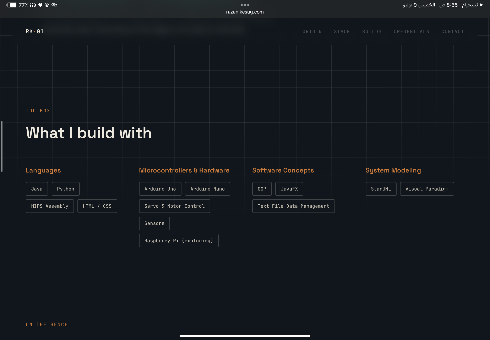
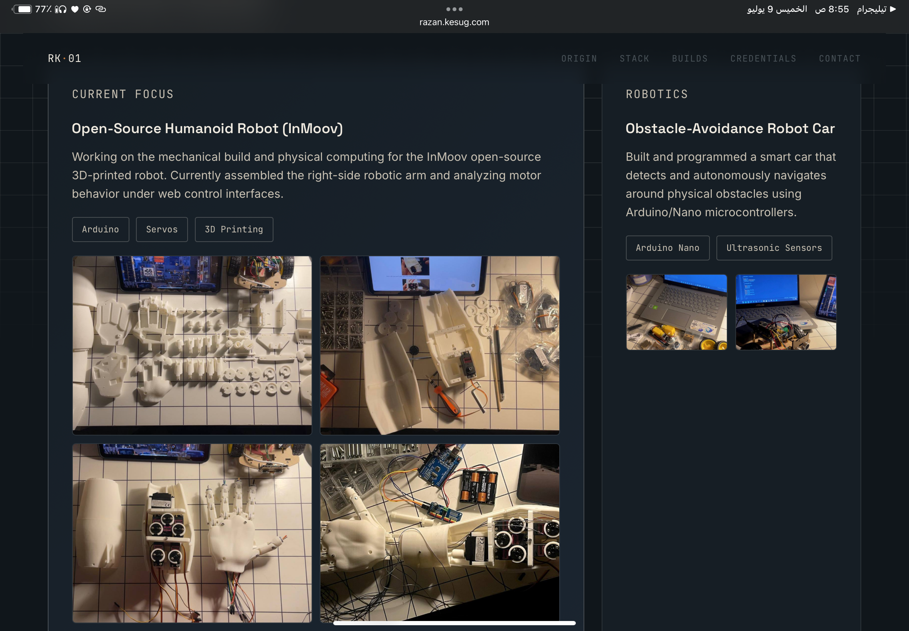
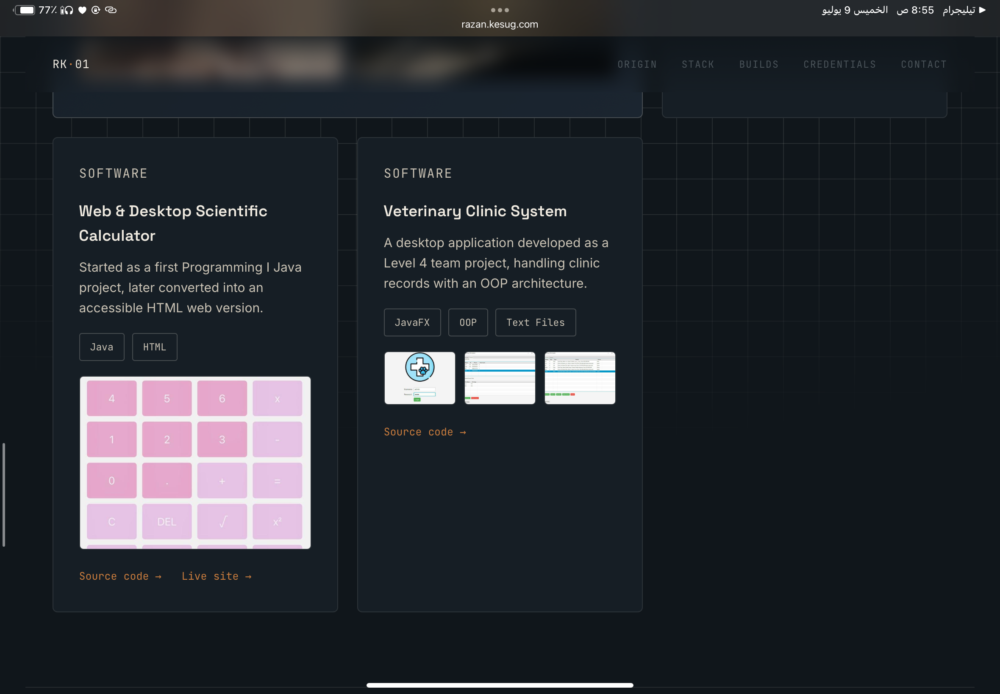
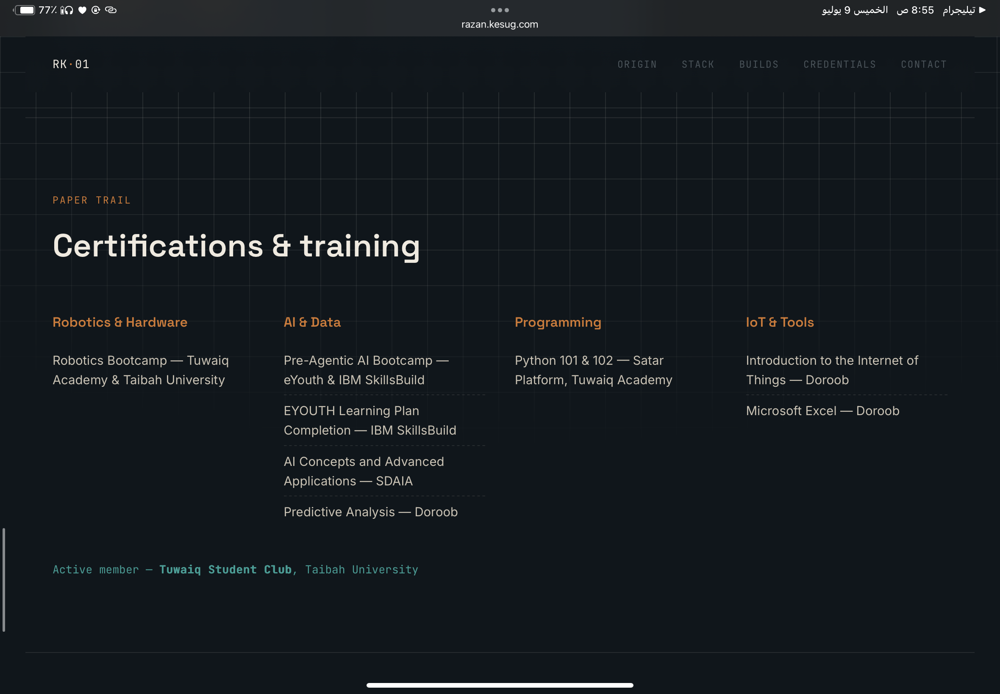
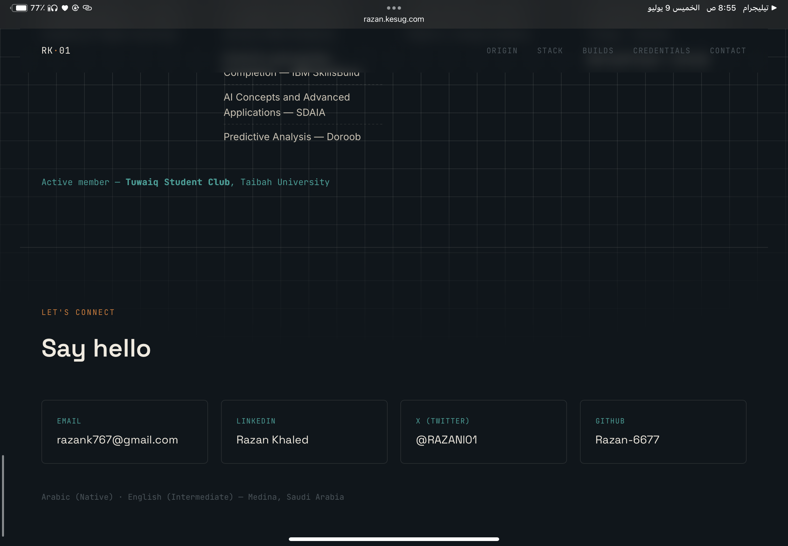

# Task 1 - Personal Website

## Task Description
Create and design a personal website. Attach all files and write a README explaining the work in GitHub.

## Overview
A personal portfolio website built with HTML and CSS, showcasing my background, technical skills, robotics/hardware projects, certifications, and contact information.

## Live Site
The website is deployed using [InfinityFree](https://www.infinityfree.com) hosting.

🔗 [razan.kesug.com](https://razan.kesug.com/?i=1)

## Website Preview

## Files
- [index.html](code/index.html) — page structure and content
- [style.css](code/style.css) — styling and layout

## Tech Used
HTML, CSS
