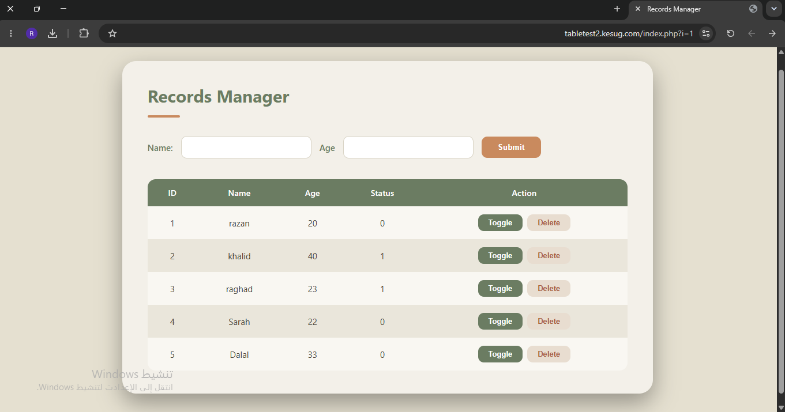

# Task 2 - Database Records Manager

## Task Description

Design a webpage using necessary web languages (HTML, CSS, JavaScript, and PHP) to fulfill the following requirements:
1. Create a one-line form that includes name, age, and a submit button.
2. Store submitted data into a MySQL database table.
3. Display all records from the table below the form.
4. Add a toggle button for each record to switch the status value between 0 and 1.
5. Reflect the updated status immediately on the webpage after toggling.

## Overview

A full-stack web application programmed using Notepad++. It features a front-end form to capture user input, a backend PHP script to store and retrieve data from a MySQL database, and asynchronous JavaScript (AJAX) to instantly update the status of each record without reloading the page.

## Live Site

The website is deployed using [InfinityFree](https://infinityfree.com/) hosting.

🔗 [tabletest2.kesug.com](https://tabletest2.kesug.com/index.php?i=1)

## Website Preview

## Files

* [index.php](code/index.php) — Page structure, form handling, and backend database connection
* [style.css](code/style.css) — Styling, layout, and UI color theme
* [script.js](code/script.js) — Frontend logic and asynchronous requests for the toggle button
* [database.sql](code/database.sql) — SQL queries for creating the database table

## Tech Used

HTML, CSS, JavaScript, PHP, MySQL, Notepad++
